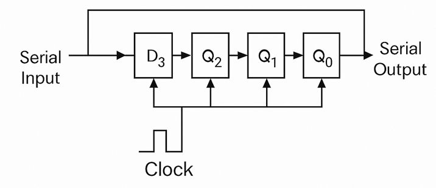

### Task 1: 4-bit Serial Input Serial Output (SISO) Shift Register

#### Circuit Diagram

_Figure 1: 4-bit SISO shift register circuit diagram showing 4 D flip-flops connected in series with common clock input. Reference: Theory section_

#### Components Required

- 4 D Flip-Flops
- Input bits: D (Serial Input), Clk (Clock)
- Output bits: Q1, Q2, Q3, Q4 (showing data progression through each flip-flop stage)

#### Circuit Connections

1. Drag the first D Flip-Flop and connect its Clk input point to the **Clk** input bit and its D input point to the **D** input bit. Connect its Q output point to the **Q1** output bit.
2. Drag the second D Flip-Flop and connect its Clk input point to the **Clk** input bit and its D input point to the Q output point of the first D Flip-Flop. Connect its Q output point to the **Q2** output bit.
3. Drag the third D Flip-Flop and connect its Clk input point to the **Clk** input bit and its D input point to the Q output point of the second D Flip-Flop. Connect its Q output point to the **Q3** output bit.
4. Drag the fourth D Flip-Flop and connect its Clk input point to the **Clk** input bit and its D input point to the Q output point of the third D Flip-Flop. Connect its Q output point to the **Q4** output bit.
5. Set the value of D (double-click to toggle), click on "Simulate" and observe the outputs Q1, Q2, Q3, Q4 with varying clock values.

#### Observations

- When Clk is 0, all output bits remain unchanged. When Clk transitions from 0 to 1 (positive edge), data shifts through the register by one position.
- **Data Flow Visualization**: Q1 shows the most recent input, Q2 shows data delayed by 1 clock cycle, Q3 shows data delayed by 2 clock cycles, and Q4 shows data delayed by 3 clock cycles.
- The serial data input D is shifted through each flip-flop stage with each clock pulse, creating a visible progression through Q1 → Q2 → Q3 → Q4.
- After 4 complete clock cycles, the original input data will appear at Q4 output.
- If the circuit has been made as described above, a "Success" message will be displayed upon clicking "Submit".

### Task 2: 4-bit Parallel Input Parallel Output (PIPO) Register

#### Circuit Diagram

_Figure 2: 4-bit PIPO register circuit diagram showing 4 D flip-flops with parallel inputs and outputs connected to a common clock. Reference: Theory section_

#### Components Required

- 4 D Flip-Flops
- Input bits: P4, P3, P2, P1 (Parallel Inputs), Clk (Clock)
- Output bits: Q4, Q3, Q2, Q1 (Parallel Outputs)

#### Circuit Connections

1. Drag the first D Flip-Flop and connect its Clk input point to the **Clk** input bit and its D input point to the **P1** input bit. Also connect its Q output point to the **Q1** output bit.
2. Drag the second D Flip-Flop and connect its Clk input point to the **Clk** input bit and its D input point to the **P2** input bit. Also connect its Q output point to the **Q2** output bit.
3. Drag the third D Flip-Flop and connect its Clk input point to the **Clk** input bit and its D input point to the **P3** input bit. Also connect its Q output point to the **Q3** output bit.
4. Drag the fourth D Flip-Flop and connect its Clk input point to the **Clk** input bit and its D input point to the **P4** input bit. Also connect its Q output point to the **Q4** output bit.
5. Set the values of P1, P2, P3, and P4 (double-click to toggle each), click on "Simulate" and observe the parallel outputs Q1, Q2, Q3, Q4 with varying clock values.

#### Observations

- When Clk is 0, the output bits Q1, Q2, Q3, and Q4 remain unchanged. When Clk transitions from 0 to 1 (positive edge), all parallel inputs are simultaneously loaded into their respective flip-flops.
- The parallel loading allows all 4 bits of data to be stored simultaneously in a single clock cycle: Q1 = P1, Q2 = P2, Q3 = P3, and Q4 = P4.
- If the circuit has been made as described above, a "Success" message will be displayed upon clicking "Submit".

---

**Note:** This simulation environment provides two different register implementations to understand fundamental register operations. Use the tabs at the top to switch between "Serial Register" (SISO) and "Parallel Register" (PIPO) tasks. Each task tests your understanding of different data storage and transfer methods in digital circuits.
