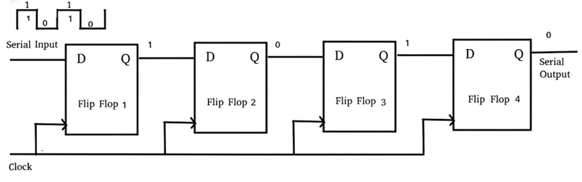
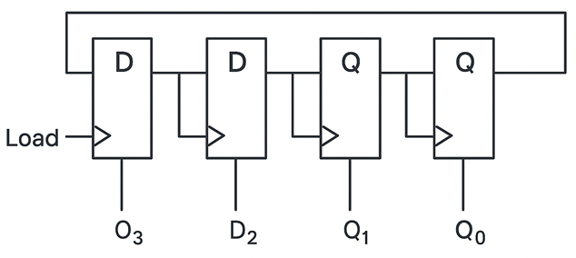
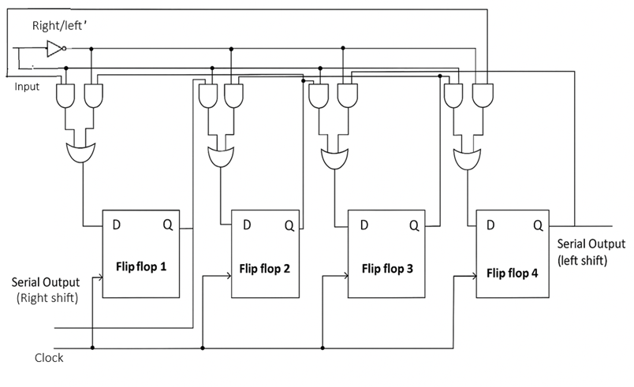

### Basic Storage Register

_Figure 1: Basic Storage Register circuit diagram showing D flip-flops with common clock for synchronized data storage. Reference: Fundamental register implementation_

A basic storage register is a group of flip-flops used to store binary data. Each flip-flop can store one bit of information, and multiple flip-flops are combined to create registers of desired bit-width. The most common type uses D flip-flops with a common clock signal to ensure synchronized data storage and retrieval.

#### Logic Operation

In a basic n-bit register using D flip-flops:

**Data Storage**: When the clock signal transitions (positive or negative edge), the data present at the D inputs is stored in the flip-flops and appears at the Q outputs.

**Data Retention**: Between clock transitions, the stored data remains stable at the outputs regardless of changes in the input data.

#### Logic Equations

For an n-bit register:

$$Q_i(n+1) = D_i \quad \text{for } i = 0, 1, 2, \ldots, n-1$$

Where:

- $Q_i(n+1)$ is the next state of the i-th flip-flop
- $D_i$ is the data input to the i-th flip-flop
- Clock edge triggers the data transfer

#### Key Features

- Stores binary data temporarily for processing
- Uses D flip-flops for reliable data storage
- Synchronized operation with clock signal
- Data width determined by number of flip-flops
- Foundation for more complex sequential circuits

#### Truth Table (4-bit Register)

| Clock Edge | D₃  | D₂  | D₁  | D₀  | Q₃  | Q₂  | Q₁  | Q₀  |
| ---------- | --- | --- | --- | --- | --- | --- | --- | --- |
| ↑          | 0   | 1   | 0   | 1   | 0   | 1   | 0   | 1   |
| No Edge    | 1   | 0   | 1   | 0   | 0   | 1   | 0   | 1   |
| ↑          | 1   | 1   | 0   | 0   | 1   | 1   | 0   | 0   |

#### Timing Characteristics

- **Setup Time**: Data must be stable before clock edge
- **Hold Time**: Data must remain stable after clock edge
- **Propagation Delay**: Time from clock edge to output change
- **Clock Skew**: Variation in clock arrival times across flip-flops

#### Applications

- Temporary data storage in processors
- Buffer registers in data paths
- State storage in control units
- Pipeline registers in pipelined processors

### Register with Parallel Load

_Figure 2: Register with Parallel Load circuit diagram showing control logic for selective data loading. Reference: Advanced register implementation_

A register with parallel load capability includes additional control logic to selectively load new data or retain existing data. This is achieved using a LOAD control signal and multiplexers (or equivalent logic) that choose between the current stored data and new input data.

#### Logic Operation

The register operates in two modes based on the LOAD control signal:

**LOAD = 1 (Load Mode)**: New data from inputs D₃D₂D₁D₀ is loaded into the register on the next clock edge.

**LOAD = 0 (Hold Mode)**: The register retains its current contents, ignoring the input data.

#### Logic Equations

For each bit position $i$ in the register:

$$\text{FF\_Input}[i] = \text{LOAD} \cdot D[i] + \overline{\text{LOAD}} \cdot Q[i]$$

This can be implemented using:

- **Multiplexers**: Select between $D[i]$ and $Q[i]$ based on LOAD signal
- **OR-AND logic**: $(\text{LOAD} \land D[i]) \lor (\neg\text{LOAD} \land Q[i])$

#### Key Features

- Conditional data loading based on control signal
- Preserves data when loading is disabled
- Uses feedback from outputs to maintain state
- Essential for implementing registers in processors
- Enables selective updating of stored information

#### Control Signal Operation

| LOAD | Operation | Next State        | Description                    |
| ---- | --------- | ----------------- | ------------------------------ |
| 0    | Hold      | Q = Current Value | Data preserved, inputs ignored |
| 1    | Load      | Q = D (New Data)  | New data loaded on clock edge  |

#### PIPO Register Example

**Scenario**: 4-bit parallel register with inputs P₃P₂P₁P₀ = 1010

**LOAD = 1, Clock Edge**:

- All flip-flops load simultaneously
- Q₃ = P₃ = 1, Q₂ = P₂ = 0, Q₁ = P₁ = 1, Q₀ = P₀ = 0
- Result: Register stores 1010 in one clock cycle

**LOAD = 0, Clock Edge**:

- All flip-flops retain previous values
- Parallel inputs P₃P₂P₁P₀ are ignored
- Register continues to hold 1010

This parallel operation is much faster than serial loading, making it ideal for processor registers and data storage applications.

#### Applications

- Processor registers with selective updating
- Accumulator registers in arithmetic units
- Status registers in control systems
- Configuration registers in digital systems

### Shift Registers

Shift registers are sequential circuits that can move data in a specific direction (left or right) with each clock pulse. They are fundamental building blocks for serial data transmission, data conversion, and arithmetic operations like multiplication and division.

#### Types of Shift Registers

**1. Serial-In-Serial-Out (SISO)**

- Data enters serially at one end
- Data exits serially from the other end
- Functions as a delay line

**2. Serial-In-Parallel-Out (SIPO)**

- Data enters serially
- All bits available simultaneously at parallel outputs
- Used for serial-to-parallel conversion

**3. Parallel-In-Serial-Out (PISO)**

- Data loaded in parallel
- Data shifted out serially
- Used for parallel-to-serial conversion

**4. Parallel-In-Parallel-Out (PIPO)**

- Data can be loaded in parallel
- Data shifted internally
- Parallel output available at any time

#### Logic Operation (Right Shift Register)

For a 4-bit right shift register:

**Shift Operation**: On each clock pulse, data moves one position to the right:

- Q₀ ← Q₁
- Q₁ ← Q₂
- Q₂ ← Q₃
- Q₃ ← Serial Input

#### Logic Equations

For a right shift register:

$$Q_0(n+1) = Q_1(n)$$
$$Q_1(n+1) = Q_2(n)$$
$$Q_2(n+1) = Q_3(n)$$
$$Q_3(n+1) = \text{Serial\_Input}$$

For a left shift register:

$$Q_3(n+1) = Q_2(n)$$
$$Q_2(n+1) = Q_1(n)$$
$$Q_1(n+1) = Q_0(n)$$
$$Q_0(n+1) = \text{Serial\_Input}$$

#### Key Features

- Sequential data movement with each clock pulse
- Bidirectional operation possible (left or right shift)
- Can function as delay lines
- Essential for serial communication
- Used in arithmetic operations

#### Example Operation (4-bit Right Shift)

| Clock | Serial Input | Q₃  | Q₂  | Q₁  | Q₀  | Serial Output |
| ----- | ------------ | --- | --- | --- | --- | ------------- |
| 0     | -            | 1   | 0   | 1   | 1   | -             |
| 1     | 0            | 0   | 1   | 0   | 1   | 1             |
| 2     | 1            | 1   | 0   | 1   | 0   | 1             |
| 3     | 0            | 0   | 1   | 0   | 1   | 0             |

#### Step-by-Step SISO Operation

**Initial State**: Register contains 1011 (Q₃Q₂Q₁Q₀)

**Clock Pulse 1** (Serial Input = 0):

- New bit 0 enters Q₃
- Q₃ → Q₂, Q₂ → Q₁, Q₁ → Q₀
- Result: 0101, Serial Output = 1

**Clock Pulse 2** (Serial Input = 1):

- New bit 1 enters Q₃
- Data shifts right again
- Result: 1010, Serial Output = 1

This demonstrates how data moves through the register with each clock pulse, creating a delay line effect.

#### Applications

- Serial communication systems (UART, SPI)
- Data conversion between serial and parallel formats
- Digital signal processing applications
- Multiplication and division circuits
- Pseudo-random number generators

### Bidirectional Shift Register

_Figure 3: Bidirectional Shift Register circuit diagram showing multiplexer-based control for left/right shift operations. Reference: Advanced sequential processing implementation_

A bidirectional shift register can shift data in either direction (left or right) based on a control signal. This versatility makes it useful in applications requiring flexible data movement and arithmetic operations.

#### Logic Operation

The register operates in three modes based on control signals:

- **Right Shift (DIR = 0)**: Data shifts from left to right (MSB to LSB)
- **Left Shift (DIR = 1)**: Data shifts from right to left (LSB to MSB)
- **Parallel Load**: Data can be loaded in parallel when enabled

#### Control Logic

For each flip-flop position, multiplexers select the appropriate data source:

**For $Q[i]$**:

- Right Shift: Input = $Q[i+1]$
- Left Shift: Input = $Q[i-1]$
- Parallel Load: Input = $D[i]$

#### Logic Equations

For bit position $i$:

$$
Q[i](n+1) = \begin{cases}
D[i] & \text{if LOAD = 1} \\
Q[i+1](n) & \text{if LOAD = 0, DIR = 0 (Right Shift)} \\
Q[i-1](n) & \text{if LOAD = 0, DIR = 1 (Left Shift)}
\end{cases}
$$

#### Key Features

- Flexible data movement in both directions
- Multiplexer-based control for direction selection
- Can perform both logical and arithmetic shifts
- Essential for arithmetic operations
- Useful in data manipulation applications

#### Control Signal Operation

| LOAD | DIR | Operation     |
| ---- | --- | ------------- |
| 1    | X   | Parallel Load |
| 0    | 0   | Right Shift   |
| 0    | 1   | Left Shift    |

#### Applications

- Arithmetic operations (multiplication/division by 2)
- Barrel shifters in processors
- Data alignment in memory systems
- Digital signal processing
- Bit manipulation operations

### Register Comparison and Selection

| Register Type  | Control Inputs | Primary Function       | Key Advantage        |
| -------------- | -------------- | ---------------------- | -------------------- |
| Basic Storage  | CLK            | Data storage           | Simple, reliable     |
| Parallel Load  | CLK, LOAD      | Conditional storage    | Selective updating   |
| Shift Register | CLK, Serial In | Serial data processing | Data conversion      |
| Bidirectional  | CLK, LOAD, DIR | Flexible shifting      | Versatile operations |

### Timing Analysis

#### Critical Timing Parameters

For all register types, proper timing must be maintained:

- **Setup Time ($t_{su}$)**: Data must be stable before clock edge
- **Hold Time ($t_h$)**: Data must remain stable after clock edge
- **Clock-to-Output Delay ($t_{pd}$)**: Propagation delay through flip-flop
- **Maximum Frequency ($f_{max}$)**: $f_{max} = \frac{1}{t_{pd} + t_{su} + t_{skew}}$

#### Clock Skew Considerations

In multi-bit registers, clock skew can cause timing violations:

- **Positive Skew**: Clock arrives later at some flip-flops
- **Negative Skew**: Clock arrives earlier at some flip-flops
- **Mitigation**: Balanced clock distribution networks

### Practical Design Considerations

#### Power Consumption

- **Dynamic Power**: $P_{dynamic} = \alpha \cdot C_{load} \cdot V_{DD}^2 \cdot f_{clk}$
- **Static Power**: Leakage current in modern CMOS processes
- **Clock Power**: Significant portion due to high fan-out

#### Noise Immunity

- **Supply Voltage Variations**: Affect timing and functionality
- **Ground Bounce**: Due to simultaneous switching
- **Cross-talk**: Between adjacent signal lines

#### Design Trade-offs

- **Speed vs. Power**: Faster registers consume more power
- **Area vs. Functionality**: More features require more silicon area
- **Robustness vs. Performance**: Conservative design vs. aggressive timing

### Registers as Building Blocks

Registers serve as fundamental building blocks in digital systems and can be combined to create more complex circuits:

#### Counter Circuits

Registers can be configured with feedback logic to create counters:

- **Binary Counters**: Count in binary sequence using T or JK flip-flops
- **Ring Counters**: Circular shift of a single '1' bit through shift register
- **Johnson Counters**: Modified ring counters with inverted feedback

#### Memory Systems

Multiple registers can form basic memory structures:

- **Register Files**: Collections of registers for processor storage
- **Cache Memory**: Fast storage using register arrays with tag and data fields
- **Buffer Memory**: Temporary storage for data transfer between different clock domains

#### Data Path Components

Registers are essential in processor data paths:

- **Pipeline Registers**: Store intermediate results between processing stages
- **Accumulator Registers**: Store arithmetic operation results
- **Address Registers**: Hold memory addresses for data access
- **Instruction Registers**: Store the current instruction being executed

### Advanced Register Applications

#### Processor Design

- **Program Counter (PC)**: Special register storing next instruction address
- **Stack Pointer (SP)**: Points to top of stack in memory
- **Status Register**: Stores processor flags (carry, zero, overflow, etc.)
- **General Purpose Registers**: For temporary data storage during computation

#### Communication Systems

- **Transmit/Receive Buffers**: Store data for serial communication
- **Protocol State Machines**: Use registers to track communication states
- **Error Detection/Correction**: Syndrome registers for ECC codes

#### Digital Signal Processing

- **Delay Lines**: Implement FIR filter structures using shift registers
- **Circular Buffers**: For continuous data streaming applications
- **Coefficient Storage**: For adaptive filter implementations

### Key Design Considerations

#### Timing Requirements

- **All registers must operate synchronously** with the system clock
- **Setup and hold times** must be satisfied for reliable operation
- **Clock distribution** must minimize skew across large register arrays

#### Data Width Compatibility

- **Register width must match** the data path requirements
- **Bus interface standards** (8-bit, 16-bit, 32-bit, 64-bit)
- **Endianness considerations** for multi-byte data storage

#### Control Logic Design

- **Appropriate control signals** for loading and shifting operations
- **Priority encoding** for multiple control inputs
- **Reset and initialization** capabilities for system startup

#### Performance Optimization

- **Efficient design to minimize** power usage in large register arrays
- **Speed optimization** through careful flip-flop selection
- **Area optimization** using shared control logic where possible
